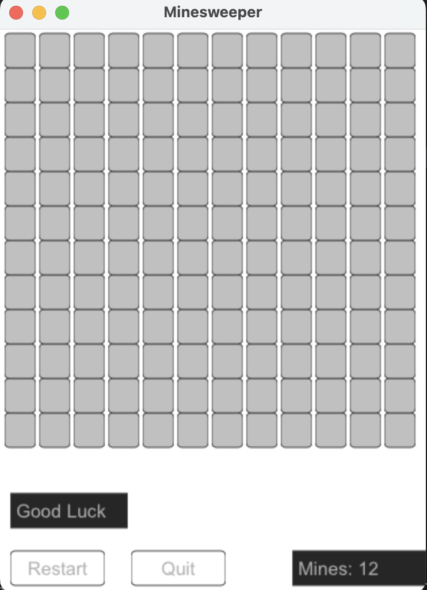

# Minesweeper
## Project description
Answering an assignements in in the courseTDT4102 - Procedural and Object-Oriented Programming at NTNU
Using libraries provided by NTNU (`AnimationWindow`).

This project aims to produce the graphics and functionality required to play the classical game minesweeper.

## How to play
- `control + fn + F5` to run the game.
- Open a tile with left click.
- Flag a tile with right click.
- Flag all mine-tiles to win the game!


 
## Editability
The game can be edited in ```main.cpp```:
 ```
int main() {

    constexpr int width = 12;
    constexpr int height = 12;
    constexpr int mines = 12;

    ...

}
```
These values can be chosen to decide whatever wanted size and difficulty of the game.

_Written in VSCode on MacOS_
